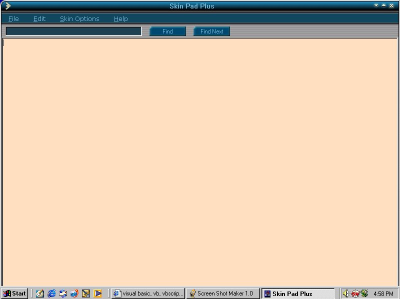

## Skin Pad Plus 1\.6

### Description

Not a big update i just added skins to the buttons. Thanks to Clint LaFever for the idea of skinning the buttons, he originally gave me the idea to implement that so that credit goes to him. Also thanks Clint for pointing out the bug with the rtf saving as text when rtf save mode was chosen. :) 

----

Once again people if you have constructive criticism that is very much welcomed but please don't criticize my hard work because i used an add on... thats what programming is all about using or making an add on and we all use add ons to make our add ons. So please only constructive criticism or thoughts on how i could improve this program... you all are free to edit this in any way you like but if you post it anywhere please just give me credit for it. :) 

----

Fixed the button height due to one of the skins loading over the words on the command buttons.
 
### More Info
 

             |
---                |---
**Submitted On**   |2000-09-21 18:46:22
**By**             |[Chris ](https://github.com/Planet-Source-Code/PSCIndex/blob/master/ByAuthor/chris.md)
**Level**          |Intermediate
**User Rating**    |4.0 (20 globes from 5 users)
**Compatibility**  |VB 6\.0
**Category**       |[Complete Applications](https://github.com/Planet-Source-Code/PSCIndex/blob/master/ByCategory/complete-applications__1-27.md)
**World**          |[Visual Basic](https://github.com/Planet-Source-Code/PSCIndex/blob/master/ByWorld/visual-basic.md)
**Archive File**   |[CODE\_UPLOAD100569212000\.zip](https://github.com/Planet-Source-Code/chris-skin-pad-plus-1-6__1-11599/archive/master.zip)

